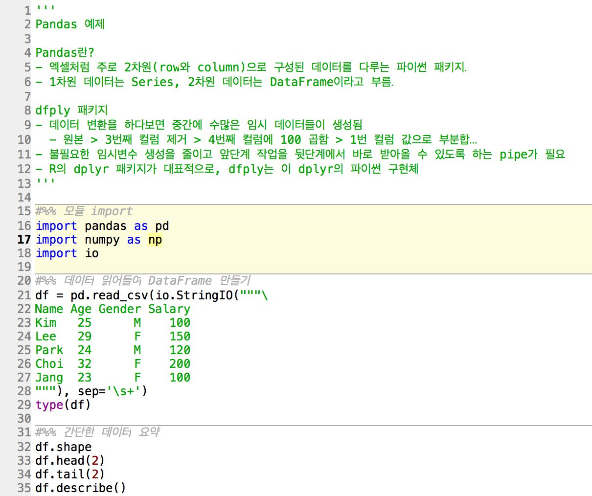

# 프로젝트 개요
- python을 이용한 데이터분석 실습용 프로젝트
- IDE로는 [Spyder](https://github.com/spyder-ide/spyder)를 사용

# 프로젝트 이용 환경
## Mac OS/X
- [anaconda](https://www.continuum.io/downloads) 환경을 이용

# Spyder 이용하기
## 주요 개념
### 코드셀(Code cell)

- 한꺼번에 실행되어야 하는 코드의 묶음(block)
- #%%로 시작하여 다음 #%%가 나올때까지가 하나로 묶임
- Shift+Enter로 한꺼번에 실행

## 패키지 설치: IPython 내에서 pip 이용
- 아래와 같이 IPython 콘솔에서 !pip install [패키지이름]
```
!pip install scrapy
Collecting scrapy
  Using cached Scrapy-1.3.3-py2.py3-none-any.whl
Requirement already satisfied: service-identity in /Users/hkjinlee/anaconda3/lib/python3.6/site-packages (from scrapy)
Requirement already satisfied: pyOpenSSL in /Users/hkjinlee/anaconda3/lib/python3.6/site-packages (from scrapy)
Requirement already satisfied: parsel>=1.1 in /Users/hkjinlee/anaconda3/lib/python3.6/site-packages (from scrapy)
Requirement already satisfied: lxml in /Users/hkjinlee/anaconda3/lib/python3.6/site-packages (from scrapy)
Requirement already satisfied: w3lib>=1.15.0 in /Users/hkjinlee/anaconda3/lib/python3.6/site-packages (from scrapy)
Requirement already satisfied: Twisted>=13.1.0 in /Users/hkjinlee/anaconda3/lib/python3.6/site-packages (from scrapy)
Requirement already satisfied: queuelib in /Users/hkjinlee/anaconda3/lib/python3.6/site-packages (from scrapy)
Requirement already satisfied: PyDispatcher>=2.0.5 in /Users/hkjinlee/anaconda3/lib/python3.6/site-packages (from scrapy)
Requirement already satisfied: cssselect>=0.9 in /Users/hkjinlee/anaconda3/lib/python3.6/site-packages (from scrapy)
Requirement already satisfied: six>=1.5.2 in /Users/hkjinlee/anaconda3/lib/python3.6/site-packages (from scrapy)
Requirement already satisfied: pyasn1-modules in /Users/hkjinlee/anaconda3/lib/python3.6/site-packages (from service-identity->scrapy)
Requirement already satisfied: attrs in /Users/hkjinlee/anaconda3/lib/python3.6/site-packages (from service-identity->scrapy)
Requirement already satisfied: pyasn1 in /Users/hkjinlee/anaconda3/lib/python3.6/site-packages (from service-identity->scrapy)
Requirement already satisfied: cryptography>=1.3.4 in /Users/hkjinlee/anaconda3/lib/python3.6/site-packages (from pyOpenSSL->scrapy)
Requirement already satisfied: incremental>=16.10.1 in /Users/hkjinlee/anaconda3/lib/python3.6/site-packages (from Twisted>=13.1.0->scrapy)
Requirement already satisfied: zope.interface>=4.0.2 in /Users/hkjinlee/anaconda3/lib/python3.6/site-packages (from Twisted>=13.1.0->scrapy)
Requirement already satisfied: constantly>=15.1 in /Users/hkjinlee/anaconda3/lib/python3.6/site-packages (from Twisted>=13.1.0->scrapy)
Requirement already satisfied: Automat>=0.3.0 in /Users/hkjinlee/anaconda3/lib/python3.6/site-packages (from Twisted>=13.1.0->scrapy)
Requirement already satisfied: idna>=2.0 in /Users/hkjinlee/anaconda3/lib/python3.6/site-packages (from cryptography>=1.3.4->pyOpenSSL->scrapy)
Requirement already satisfied: setuptools>=11.3 in /Users/hkjinlee/anaconda3/lib/python3.6/site-packages/setuptools-27.2.0-py3.6.egg (from cryptography>=1.3.4->pyOpenSSL->scrapy)
Requirement already satisfied: cffi>=1.4.1 in /Users/hkjinlee/anaconda3/lib/python3.6/site-packages (from cryptography>=1.3.4->pyOpenSSL->scrapy)
Requirement already satisfied: pycparser in /Users/hkjinlee/anaconda3/lib/python3.6/site-packages (from cffi>=1.4.1->cryptography>=1.3.4->pyOpenSSL->scrapy)
Installing collected packages: scrapy
Successfully installed scrapy-1.3.3
```

## 핫키(shortcut)
### 창 이동
- cmd+shift+E: 에디터
- cmd+shift+I: IPython 콘솔
- cmd+shift+C: Python 콘솔
- cmd+shift+V: 변수 탐색기
- cmd+shift+H: 도움말

### 코드 실행
- 블럭설정 뒤 cmd+Enter: 
현재 선택된 블럭 실행
- shift+Enter: 현재 code cell 실행
